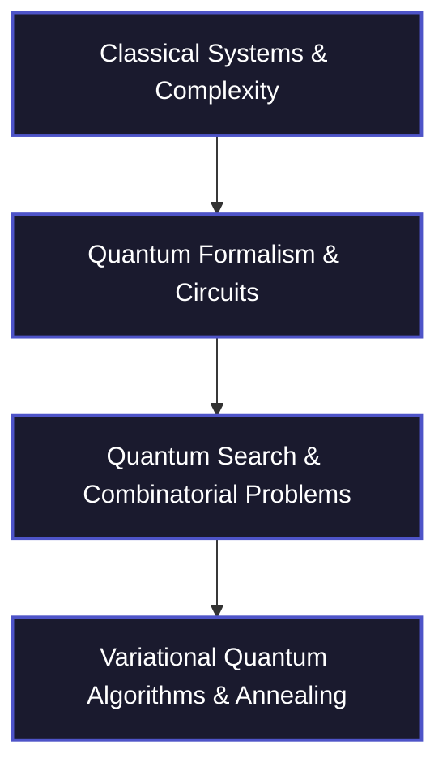

# QWorld Workshop — Technical Notebooks & Labs

> An active repository for course notes, technical summaries, and quantum optimization notebooks prepared for the QWorld / OQI Bootcamp.

---

## Repository Overview

This repository serves as a centralized workstation for the QWorld Workshop. It contains detailed session summaries, theoretical derivations, and Jupyter Notebook labs transitioning from classical systems to quantum mechanical algorithms and NISQ-era optimization.

---

## Structure & Standard Nomenclature

*   **[Action Plan.md](Action%20Plan.md)**: Active tracking sheet containing objectives, roadmap, study protocols, and session schedules.
*   **[qubo_formulation.ipynb](qubo_formulation.ipynb)**: Hands-on Jupyter notebook covering objective functions, matrices, and constraint penaltization for Max-Cut, Knapsack, and Traveling Salesman problems using the D-Wave Ocean SDK.
*   **[Lectures/](Lectures/)**: Chronological technical summaries (Day 1 through Day 10) covering each session in detail:

### Lectures Roadmap

| Lecture File | Core Technical Focus | Key Mathematical & Algorithm Concepts |
| :--- | :--- | :--- |
| **[Day 1](Lectures/Day-1-Qworld.md)** | Complexity & NISQ Era | Church-Turing Thesis, $\text{P} \neq \text{NP}$, $\text{BQP}$, Quantum Advantage, Dequantization |
| **[Day 2](Lectures/Day-2-Qworld.md)** | Classical Systems | Stochastic Matrices, Convex Combinations, Tensor Products, Classical CNOT |
| **[Day 3](Lectures/Day-3-Qworld.md)** | Quantum Qubits | Bra-Ket Notation, Born Rule, Unitary Matrices, Hadamard Gate & Intererference |
| **[Day 4](Lectures/Day-4-Qworld.md)** | Gates & Operations | Rotations, Pauli $X/Z$, Bloch Circle, Correlation vs. Communication |
| **[Day 5](Lectures/Day-5-Qworld.md)** | Protocols & Qiskit | Bell States, Superdense Coding, Quantum Teleportation, Qiskit registers |
| **[Day 6](Lectures/Day-6-Qworld.md)** | Quantum Algorithms | Reversibility, Boolean Oracles, Phase Kickback, Grover Search Derivation |
| **[Day 7](Lectures/Day-7-Qworld.md)** | Grover Applications | Diffusion Operator Circuit, Max-Cut Oracle, Parity Edge Checks, Adders |
| **[Day 8](Lectures/Day-8-Qworld.md)** | Optimization & QUBO | Combinatorial Optimization, $Q$ Matrix, Penalty Methods, Slack Variables, TSP |
| **[Day 9](Lectures/Day-9-Qworld.md)** | QUBO ↔ Ising | Rosenberg Quadratization, Max-3SAT, Observables, VQE, Variational Principle |
| **[Day 10](Lectures/Day-10-Qworld.md)** | Annealing & QAOA | Simulated Annealing, Schrödinger Equation, Trotterization, QAOA Circuit Ansatz |

---

## Tech Stack & Tooling

*   **Languages**: Python, LaTeX, Markdown.
*   **Libraries & SDKs**: Qiskit, Google Cirq, D-Wave Ocean SDK (`dimod`).
*   **Renders**: MathJax/KaTeX (for GitHub Math visualization).

---

## Study Protocol

For every summary file, follow this 4-step loop:
1.  **Read Glossary**: Identify critical concepts in the summary table.
2.  **Derive Math**: Practice tensor products, matrix exponentials, and operator rotations manually.
3.  **Self-Assess**: Solve the flashcards and study questions included at the end of each session file.
4.  **Hands-on Labs**: Implement the mathematical formulations in the corresponding Jupyter Notebook.
